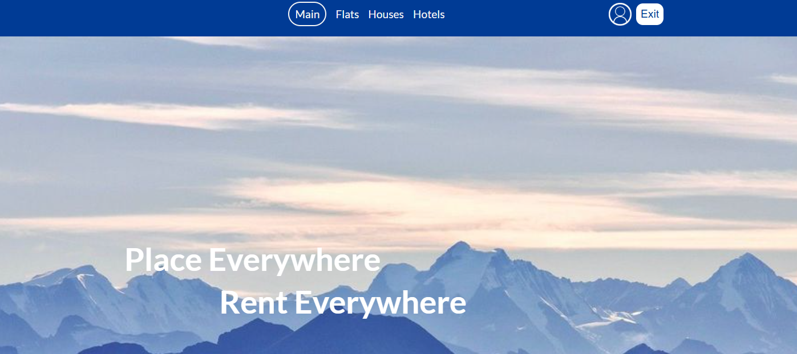

## Refactored version
[Refactored project link](https://github.com/Rope-IRL/RefactoredRentApiOpen)

# Main information

Welcome to Real Estate Rental, your ultimate platform for discovering and booking a wide range of accommodations, from cozy apartments and spacious houses to convenient hotel rooms.
To manage flats, houses, and users, **the** project uses ASP.NET with a sliced architecture and different behavior for authorized and **unauthorized** users.
## Backend architecture

## React for Frontend

Authorized users (lessees or landlords) can access their profile page by clicking on a person-shaped icon, like 

Then landlord will see

With his property tab like

And Contracts tab like 

Contract appears automatically when lessee wants to rent some property.

There are different properties to rent such as 
### Flats page

### Houses Page

